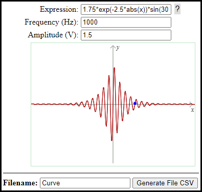

# Electric
Code to help with solutions to electric area. Now exists three examples with codes:

- [equation2wave](./equation2wave/) to generate audio wave format using the math expression. The files are written in JavaScript and there are comments to help you to modify for your purposes.  The figure can see using the [Audicity](https://www.audacityteam.org/).
- [generateSignalToHantek2D42](./generateSignalToHantek2D42/) to generate data to upload in **[Hantek2D42](http://hantek.com/products/detail/13174)**. The Hantek 2D42 has a signal generator that it can load CSV file and get signal. The code here generated, you write your math expressions and the application generate to signal data to equipment.  Window to generate signal using math expression.
- [convertFLD2CSVtoYOKOGAWA](./convertFLD2CSVtoYOKOGAWA/) to convert FLD file generate in [Yokogawa DL850E](https://www.yokogawa.com.br/produtos/teste-e-medicao/oscilloscopes/dl850edl850ev-scopecorder) to CSV where you can work in excell and other app.