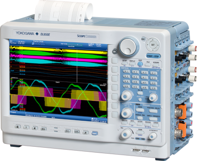

## Convert files FLD (Waveform file in floating-point format) to CSV (Comma-separated values)

The code is to convert files FLD (Waveform file in floating-point format) to CSV (Comma-separated values) and to use to plot and other analysis.

The samples generated in [Yokogawa DL850E](https://www.yokogawa.com.br/produtos/teste-e-medicao/oscilloscopes/dl850edl850ev-scopecorder) see above in figure bellow:

)

The format is FLD file save data in 32 bits integer

and the CSV format is

**number of line, value**

The code can to modify using only the JavaScript language. Te ideia to read FLD file is in https://tmi.yokogawa.com/br/library/resources/faqs/how-can-i-read-and-access-the-data-of-a-dl850-fld-file/ and https://en.wikipedia.org/wiki/Single-precision_floating-point_format