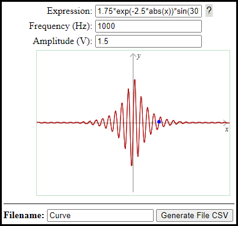

## Generator data to **[Hantek2D42](http://hantek.com/products/detail/13174)** handheld oscilloscope

The codes are to create file CSV (Comma-separated values) to upload in **[Hantek2D42](http://hantek.com/products/detail/13174)** handheld oscilloscope with ***Oscilloscope + Waveform Generator + Multimeter***.

The figure window bellow demonstrates the fields necessary, where **expression** is the field *math expression*. The help with functions math, use **?** next to field.

 

